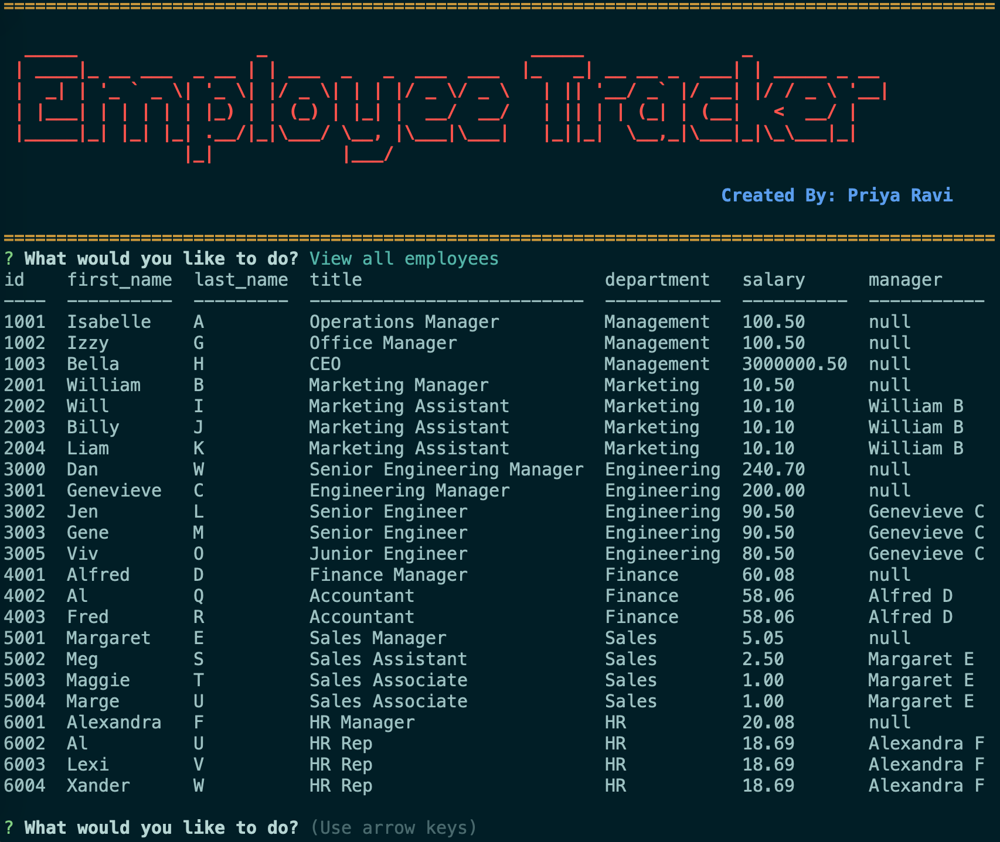
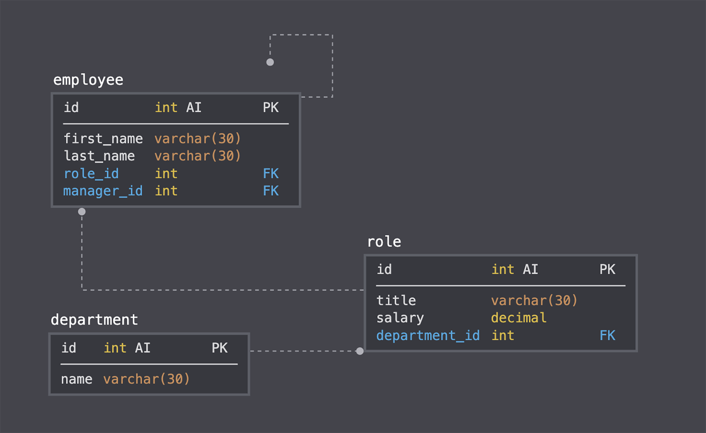

## Employee Tracker

*A command-line application to manage a company's employee database, using Node.js, Inquirer, and MySQL*

### App Screenshot



### App Demo

- View all departments, view all employees, view all roles
- add a department, add a role


- Delete a department, delete a role, exit  


- Add an employee, update employee manager, delete an employee


- Update employee role, view department budgets


- View all employees by manager, view all employees by department


### User Story

```text
AS A business owner
I WANT to be able to view and manage the departments, roles, and employees in my company
SO THAT I can organize and plan my business
```

### Acceptance Criteria

```text
GIVEN a command-line application that accepts user input
WHEN I start the application
THEN I am presented with the following options: view all departments, view all roles, view all employees, add a department, add a role, add an employee, and update an employee role
WHEN I choose to view all departments
THEN I am presented with a formatted table showing department names and department ids
WHEN I choose to view all roles
THEN I am presented with the job title, role id, the department that role belongs to, and the salary for that role
WHEN I choose to view all employees
THEN I am presented with a formatted table showing employee data, including employee ids, first names, last names, job titles, departments, salaries, and managers that the employees report to
WHEN I choose to add a department
THEN I am prompted to enter the name of the department and that department is added to the database
WHEN I choose to add a role
THEN I am prompted to enter the name, salary, and department for the role and that role is added to the database
WHEN I choose to add an employee
THEN I am prompted to enter the employee’s first name, last name, role, and manager and that employee is added to the database
WHEN I choose to update an employee role
THEN I am prompted to select an employee to update and their new role and this information is updated in the database
```

### Database Schema Design



### Schema Description

- Department
    - `id`: INT PRIMARY KEY
    - `name`: VARCHAR(30) to hold department name

- Role
    - `id`: INT PRIMARY KEY
    - `title`: VARCHAR(30) to hold role title
    - `salary`: DECIMAL to hold role salary
    - `department_id`: INT to hold reference to department role belongs to

- Employee
    - `id`: INT PRIMARY KEY
    - `first_name`: VARCHAR(30) to hold employee first name
    - `last_name`: VARCHAR(30) to hold employee last name
    - `role_id`: INT to hold reference to employee role
    - `manager_id`: INT to hold reference to another employee that is manager of the current employee. This field may be null if the employee has no manager.

### Instructions on how to run the app

- Add a .env file to the root of the app with the following details

```text
DB_NAME='all_employees'
DB_USER='root'
DB_PW='xxx'
```